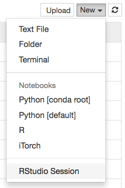

# jupyter-rsession-proxy

**jupyter-rsession-proxy** provides Jupyter server and notebook extensions to proxy RStudio.



If you have a JupyterHub deployment, jupyter-rsession-proxy can take advantage of JupyterHub's existing authenticator and spawner to launch RStudio in users' Jupyter environments. You can also run this from within Jupyter.
Note that [RStudio Server Pro](https://www.rstudio.com/products/rstudio-server-pro/architecture) has more featureful authentication and spawning than the standard version, in the event that you do not want to use Jupyter's.

## Installation

### Pre-reqs

#### Install rstudio
Use conda `conda install rstudio` or [download](https://www.rstudio.com/products/rstudio/download-server/) the corresponding package for your platform 

Note that rstudio server is needed to work with this extension.

### Install jupyter-rsession-proxy

Install the library:
```
pip install jupyter-rsession-proxy
```

The Dockerfile contains an example installation on top of [jupyter/r-notebook](https://github.com/jupyter/docker-stacks/tree/master/r-notebook).


### Multiuser Considerations

This extension launches an rstudio server process from the jupyter notebook server. This is fine in JupyterHub deployments where user servers are containerized since other users cannot connect to the rstudio server port. In non-containerized JupyterHub deployments, for example on multiuser systems running LocalSpawner or BatchSpawner, this not secure. Any user may connect to rstudio server and run arbitrary code.
